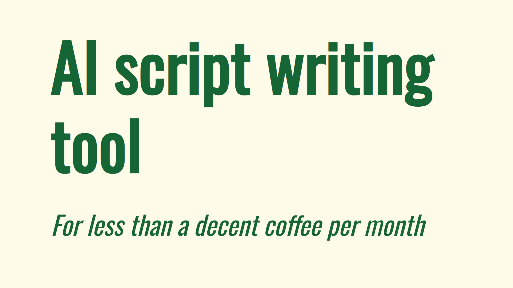

**Expensive AI tools are everywhere**, and often times the results they deliver feels like a scam. 
Sometimes they feel generic or do not have the knowledge you need in your scripts.

This proves there is another way, automating the most tedious parts of research, drafting a good starting point, and delivering insights you were missing out on.

*Bottom line: Own it, control it, save money*

## What This Does

- Pulls real research from Wikipedia (As a demo example)
- Generates contextual scripts with sources
- Gives you a summary/overview of the research. 
- Content Gap Analysis, get trending title formats, shows you what no one seems to be covering.
- Costs pennies vs hundreds per month. (All the dev work was barely over 10 cents!)
- Runs locally on your machine, even if it's a laptop from 2018.

## The Reality Check

- This is a demo/prototype, there are some quirks that don't affect functionality.
- Works well enough but does not produce 'final version' scripts in my opinion. 
- It does however give you very usable structure and information. a good starting point. 
- The marketing tools shine even in this basic setup. (A value proposition in the style of TubeMagic)


## Quick Start

Grab your OpenRouter API key. 

Install python requirements.

Run `main.py`

You can also create an executable with pyinstaller. (This is still a work in progress)


### Requirements

```
# Core GUI Framework
customtkinter>=5.2.0

# HTTP Requests
requests>=2.31.0

# Environment Variables
python-dotenv>=1.0.0

# Vector Database
chromadb>=0.4.15

# Markdown Processing
markdown2>=2.4.0

# YouTube Video Processing
yt-dlp>=2023.10.13

# Optional: For improved performance
numpy>=1.24.0

# Standard library modules (included with Python)
# tkinter, threading, time, re, pathlib, json, logging, os, sys, subprocess, urllib
```


### Setup steps

### Basic usage

## The technical stuff

### Architecture overview

Using Chroma DB and RAG we generate the script, summarize research, and thanks to some web scraping we can give that context to an LLM to give us the marketing insights.

### Known limitations

The current Chroma DB storage and retrieval are single threaded and their speed depends on your hardware.

There is a rudimentary system to prevent reloading all information at once. It can be greatly improved.

### Performance notes

All LLM calls are made through OpenRouter, however, Chroma DB is run locally.

### Developing this further.

Things I would improve:

- Chroma DB handling (multithreading)
- Improve the research functionality


## Contact

Want to incorporate AI into workflows or automations, need to solve headaches, let's [chat here, free Discovery Call](https://calendly.com/aj_ai/discovery-call).